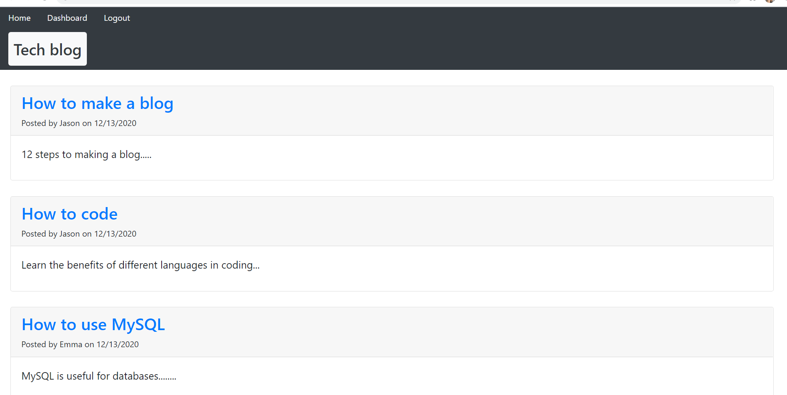
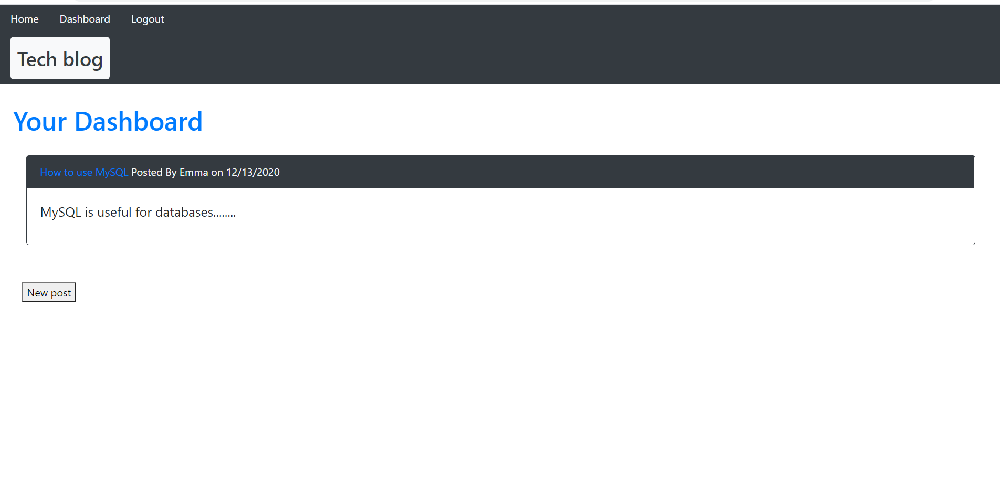

# CMS-blog

## Description

CMS blog was created as an online environment for users to write posts about the tech world. Upon entering the site, there are links for a home page, dashboard page, and the option to login. Each user has the ability to create an account with username and password included in the login link. After signing up for an account with a username and password, the user can login on future site visits. While signed in, the user can create posts which are displayed on their dashboard. If a post is selected from the dashboard, then the user can either save edits to the title and/or text body or delete the post. The user is shown the dashboard again, with the changes reflected. The home page shows all posts from any user that have been created, along with the username and the date of post creation. When a user is logged in, they can click on the post to leave a comment. When not logged in, the home page will show the posts, and comments can be viewed when clicked, however no comments can be created and added. If there is no window activity for one minute, then the user is automatically logged out.

## Images 
  

## Installation
    Node, MYSQL2, dotenv, express-handlebars, sequelize, bcrypt, express-session, connect-session-sequelize
## Usage
    For personal use.
## License
    none
## Contributors
    Joanna Grosshans, creator
## Tests
    There is a test for the fomrat_date function in the __tests__ folder.
## Questions
jgrossh2  
[GitHub](https://github.com/jgrossh2/CMS-blog)  
[Heroku webpage] (https://secret-beyond-55815.herokuapp.com/)  
Please contact <joannagrosshans2@gmail.com> for additional Information.

# Technologies used
 *JS  
 *Node  
 *MYSQL2 
 *SEQUELIZE 
 *EXPRESS-HANDLEBARS

 